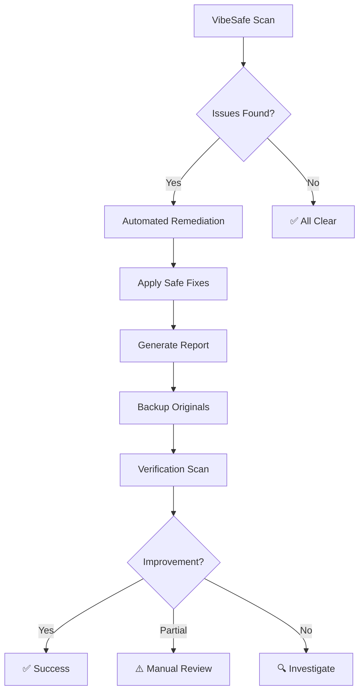

# 🛠️ VibeSafe Threat Remediation Guide

## Overview

The VibeSafe Security Framework doesn't just **identify** threats - it actively **fixes** them! This guide shows you how to use the automated remediation capabilities.

## 🎯 What Gets Fixed Automatically

### ✅ **Configuration Issues**
- **CORS Wildcards** → Environment-based origin configuration
- **Debug Mode Flags** → Production-safe configurations
- **Missing Security Headers** → Automatic helmet.js integration

### ✅ **Environment Security**
- **Missing .gitignore patterns** → Auto-added security patterns
- **Environment template** → Secure .env.example generation
- **Production scripts** → Added npm run start:prod

### ✅ **Documentation & Reporting**
- **Detailed remediation reports** → Step-by-step fix documentation
- **Before/after comparisons** → Measurable security improvements
- **Manual action guides** → Clear instructions for remaining issues

### ⚠️ **Manual Review Required** (Security-Critical)
- **Hardcoded secrets** → Must be reviewed and moved to env vars
- **Custom configurations** → Context-specific security settings
- **Business logic security** → Application-specific implementations

## 🚀 Quick Start

### 1. **Local Remediation**

```bash
# Run VibeSafe scan
vibesafe scan -o vibesafe-results.json

# Apply automated fixes
node scripts/security-remediation.js

# Review what was fixed
cat SECURITY-REMEDIATION-REPORT.md

# Verify improvements
vibesafe scan -o vibesafe-results-after-fix.json
```

### 2. **CI/CD Automated Remediation**

The framework includes a GitHub Actions workflow with automated remediation:

```bash
# Trigger manual remediation workflow
gh workflow run "VibeSafe CLI with Automated Remediation" \
  --field auto_remediate=true \
  --field create_pr=true
```

This will:
- ✅ Run VibeSafe security analysis
- 🛠️ Apply automated fixes
- 📝 Create detailed remediation report
- 🔀 Open pull request with fixes (optional)
- 🔍 Verify improvements with follow-up scan

## 📊 Remediation Capabilities

| Issue Type | Detection | Automated Fix | Manual Review |
|------------|-----------|---------------|---------------|
| **CORS Wildcards** | ✅ VibeSafe | ✅ Auto-fix | ℹ️ Verify origins |
| **Debug Flags** | ✅ VibeSafe | ✅ Auto-fix | ℹ️ Test production |
| **Missing .gitignore** | ✅ VibeSafe | ✅ Auto-fix | ✅ Ready to use |
| **Environment Template** | ✅ VibeSafe | ✅ Auto-generate | ℹ️ Configure values |
| **Hardcoded Secrets** | ✅ VibeSafe | ❌ Manual only | 🔐 **Critical** |
| **Dependencies** | ✅ VibeSafe + npm | ⚠️ Guided fixes | ⚙️ Test updates |
| **Input Validation** | ✅ VibeSafe | ❌ Manual only | 🧪 Custom logic |

## 🔄 Remediation Workflow



## 🛡️ Safety Features

### **Automatic Backups**
```bash
.security-backups/
├── .gitignore.backup.1692284561234
├── package.json.backup.1692284561235
└── src/app.js.backup.1692284561236
```

### **Non-Destructive Changes**
- ✅ Only adds missing security patterns
- ✅ Preserves existing configurations
- ✅ Creates environment templates (doesn't modify existing)
- ✅ Adds dependencies (doesn't remove existing)

### **Rollback Capability**
```bash
# Restore from backup if needed
cp .security-backups/package.json.backup.* package.json
```

## 📝 Example Remediation Report

```markdown
# Security Remediation Report

## Summary
Total Issues Found: 29
- 🔐 Secrets: 25
- ⚙️ Configuration: 2  
- ℹ️ Information: 1
- ⚠️ Gitignore: 1

## Automated Fixes Applied
- ✅ Updated .gitignore with 4 new security patterns
- ✅ Fixed CORS configuration in src/app.js
- ✅ Created .env.example template with security best practices
- ✅ Added production scripts and security dependencies

## Manual Actions Required
### Secrets (25 found)
**Action Required:**
1. Review all detected secrets in the VibeSafe report
2. Remove hardcoded secrets from source code
3. Replace with environment variables
4. Rotate any exposed credentials
```

## 🎛️ Configuration Options

### **Package.json Scripts**
```json
{
  "scripts": {
    "security:scan": "vibesafe scan -o vibesafe-results.json",
    "security:fix": "node scripts/security-remediation.js",
    "security:verify": "npm run security:scan && npm run security:fix && npm run security:scan",
    "security:report": "cat SECURITY-REMEDIATION-REPORT.md"
  }
}
```

### **Environment Variables**
```bash
# Control remediation behavior
SECURITY_REMEDIATION_BACKUP=true
SECURITY_REMEDIATION_MODE=safe  # safe|aggressive
SECURITY_REMEDIATION_SKIP_SECRETS=false
```

## 🚨 Important Security Notes

### **🔐 Secrets Handling**
- **Never auto-fix secrets** - Always requires manual review
- **Rotate exposed credentials** - Assume compromised
- **Use environment variables** - Follow .env.example template
- **Audit secret access** - Who had access to exposed secrets?

### **⚙️ Configuration Changes**
- **Test in development first** - Verify fixes work
- **Review CORS origins** - Ensure legitimate domains only
- **Check production impact** - Some fixes may break workflows
- **Monitor after deployment** - Watch for unexpected behavior

### **📦 Dependency Updates**
- **Review security advisories** - Understand what's being fixed
- **Test thoroughly** - Breaking changes possible
- **Pin critical versions** - Avoid unexpected updates

## 🎯 Best Practices

1. **Run regularly** - Weekly automated scans
2. **Test all fixes** - Don't merge without testing
3. **Document exceptions** - Some issues may be acceptable
4. **Train your team** - Everyone should understand security
5. **Monitor continuously** - Security is ongoing

## 🔗 Integration Examples

### **GitHub Actions**
```yaml
- name: Security Scan and Remediation
  run: |
    vibesafe scan -o results.json
    node scripts/security-remediation.js
    # Create PR with fixes automatically
```

### **Pre-commit Hooks**
```bash
#!/bin/bash
vibesafe scan --high-only || {
  echo "❌ Security issues detected"
  echo "Run: npm run security:fix"
  exit 1
}
```

### **CI/CD Pipeline**
```bash
# Deploy pipeline
npm run security:verify
npm run test
npm run build
npm run deploy
```

## 📚 Additional Resources

- [VibeSafe CLI Documentation](https://github.com/slowcoder360/vibesafe)
- [Security Best Practices](./guidelines/SECURITY_GUIDELINES.md)
- [Code Review Checklist](./code-review/SECURITY_CHECKLIST.md)
- [Incident Response](./incident-response/RESPONSE_PLAN.md)

---

**Remember**: Automated remediation is powerful, but security is ultimately a human responsibility. Always review, test, and validate automated fixes before deploying to production! 🛡️
